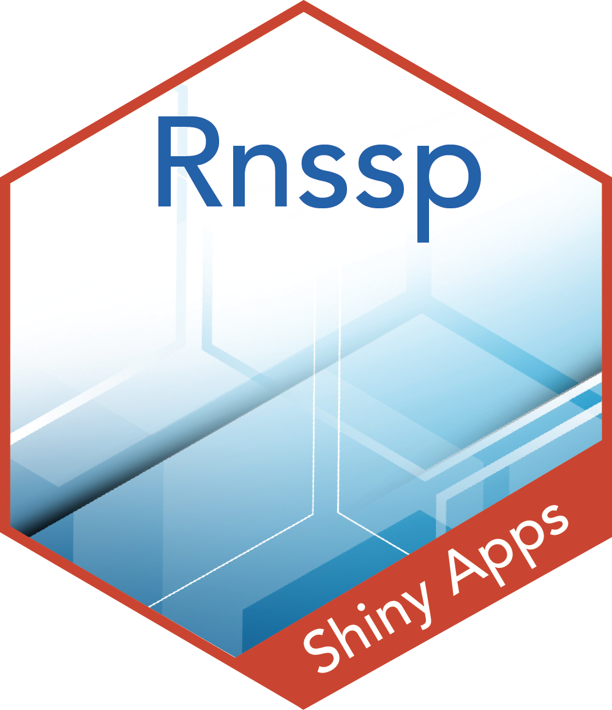

<!--
© 2024 The Johns Hopkins University Applied Physics Laboratory LLC
Development of this software was sponsored by the U.S. Government under 
contracts no. 75D30120C07643, 75D30122C15442, 75D30124C19958
-->

<!--
#----------------------------------------------------
# Scenario Detection App - Phase 1
# Authors:
#   Joshua Kimrey
#   Catherine Schwartz
#   Roseric Azondekon
#   Michael Sheppard
#----------------------------------------------------
-->

<style>
  .title-logo-container {
    display: flex;
    align-items: center;
    justify-content: center;
    margin-top: 20px; /* Adjust margin as needed */
  }
  .title-logo-container img {
    margin-right: 20px; /* Adjust spacing between logo and vertical line */
    height: 150px; /* Adjust the height as needed */
  }
  .vertical-line {
    border-left: 2px solid black; /* Adjust the width and color of the line as needed */
    height: 150px; /* Match the height of the logo */
    margin-right: 20px; /* Adjust spacing between vertical line and title */
  }
  .title-logo-container h1 {
    margin: 0;
    font-weight: bold;
  }
  #header {
    display: none;
  }
</style>

<div class="title-logo-container">
  
  <div class="vertical-line"></div>
  <h1>National Syndromic Surveillance Program<br>Scenario Detection Shiny App Report</h1>
</div>

```{r setup, include=FALSE}
library(htmltools)
library(knitr)
library(kableExtra)
library(sparkline)
knitr::opts_chunk$set(echo = TRUE)

normalize_conversion_list <- setNames(as.list(c("Count", "Proportion(%)")), c("count", "percent"))
method_conversion_list <- setNames(as.list(c("Gaussian", "Non-parametric(percentile)")), c("gauss", "percentile"))
```

<div style="text-align: center; font-size: 0.8em; font-style: italic;">
  `r paste0("Report generated on ", format(Sys.Date(), "%A, %B %d, %Y")," at ", format(Sys.time(), "%H:%M %Y %Z"),".")`
</div>

```{css user_input_table_formatting, echo = FALSE}

caption {
  color:black;
}

.scroll-100 {
  max-height: 100px;
  overflow-y: auto;
  background-color: inherit;
}

.term-table {
  font-family: 'Roboto', Helvetica, Arial, sans-serif;
  font-size: 11px;
}

.term-table a:hover {
  text-decoration: none;
}

.header {
  text-align: center;
  font-size: 20px;
}

.term-table-title {
  margin-top: 30px;
  padding: 8px;
  background-color: hsl(205, 100%, 5%);
  color: hsl(0, 0%, 98%);
  font-size: 25px;
  font-weight: 400;
}

.term-table-tbl {
  font-size: 12px;
  letter-spacing: 0.2px;
}

.term-table-header {
  border-bottom-width: 1px;
  background-color: hsl(0, 0%, 47%);
  color: hsl(0, 0%, 98%);
  font-weight: 400;
  font-size: 11px;
  text-transform: uppercase;
  transition: box-shadow 0.3s cubic-bezier(0.175, 0.885, 0.32, 1.275);
}

.term-table-header:hover,
.term-table-header[aria-sort="ascending"],
.term-table-header[aria-sort="descending"] {
  background-color: hsl(205, 100%, 5%);
}

.term-table-header[aria-sort="ascending"] {
  box-shadow: inset 0 10px 0 -6px #efaa10 !important;
}

.term-table-header[aria-sort="descending"] {
  box-shadow: inset 0 -10px 0 -6px #efaa10 !important;
}

.term-table input {
  background-color: white;
  color: black;
}

.sorted {
  background-color: hsla(0, 0%, 60%, 0.1);
}
```

```{r inputs_table, echo=FALSE}
inc_progress(msg = "Generating parameters table...", amnt = 0.25)
input_data <- data.frame(
  Parameters = c("State", "Date", "Normalization(Count/Percent)", "Detection Method"),
  Values = c(selected_state, format(as.Date(selected_date), "%B %d, %Y"), normalize_conversion_list[[selected_normalize]], method_conversion_list[[selected_method]])
)

kable(input_data, format = "html", table.attr = 'class="term-table"') %>%
  kable_styling(full_width = FALSE, position = "center") %>%
  row_spec(0, bold = TRUE, color = "white", background = "hsl(0, 0%, 47%)") %>%
  column_spec(1, bold = TRUE) %>%
  column_spec(2, color = "black", background = "hsla(0, 0%, 60%, 0.1)") %>%
  add_header_above(c("**Input Parameters**" = 2))
```

```{r selections_table, echo=FALSE}
inc_progress(msg = "Adding filter selections table...", amnt = 0.25)
selections_data <- data.frame(
  Parameters = c("Hospital Region", "Sex", "Age Group", "Discharge Diagnosis", "CCSR Category",
                 "Sub-syndrome", "CC & DD Category", "Minimum Number of Baseline Records", "Minimum Number of Test Date Records"),
  Values = c(
    ifelse(is.null(selected_region), "Not specified", substr(as.character(selected_region), 4, nchar(as.character(selected_region)))),
    ifelse(is.null(selected_sex), "Not specified", selected_sex),
    ifelse(is.null(selected_agegroup), "Not specified", selected_agegroup),
    ifelse(is.null(selected_icd10), "Not specified", selected_icd10),
    ifelse(is.null(selected_ccsr), "Not specified", selected_ccsr),
    ifelse(is.null(selected_subc), "Not specified", selected_subc),
    ifelse(is.null(selected_ccdd), "Not specified", selected_ccdd),
    ifelse(is.null(selected_min_baseline_records), "Not specified", selected_min_baseline_records),
    ifelse(is.null(selected_min_testdate_records), "Not specified", selected_min_testdate_records)
  ),
  stringsAsFactors = FALSE
)

kable(selections_data, format = "html", table.attr = 'class="term-table"') %>%
  kable_styling(full_width = FALSE, position = "center") %>%
  row_spec(0, bold = TRUE, color = "white", background = "hsl(0, 0%, 47%)") %>%
  column_spec(1, bold = TRUE) %>%
  column_spec(2, color = "black", background = "hsla(0, 0%, 60%, 0.1)") %>%
  add_header_above(c("**In-App Selections**" = 2))
```

# **Alert List Explorer**

The Alert List Explorer within the Scenario Detection app is intended as an exploratory tool to augment and extend a users ability to explore a state-level alert list. That is, rather than being presented as an expansive list of alerts computed by testing for anomalies across each unique combination of demographic and syndromic features, the alert list is presented as an interactive drill-down tool. Each map or table displays the results of tests for temporal alerts computed by stratifying all records in the current filter by only the feature to which that map or table corresponds. Accordingly, elements (rows/regions) of each feature (table/map) can be selected to filter the data for more granular levels of analysis.

##  Demographics

```{r demographicsout, echo=FALSE, message=FALSE, results='asis'}
inc_progress(msg = "Adding demographics-stratified alerts...", amnt = 0.25)
layout_demog <- div(
  style = "display: flex; justify-content: space-around; margin-left: -25%; margin-right: -25%;",
  div(style = "width: 32%;", widgets()$region_object()),
  div(style = "width: 32%;", widgets()$age_object()),
  div(style = "width: 32%;", widgets()$sex_object())
)

# Render the layout
layout_demog
```

## Diagnostic Categories

```{r diagnosticsout, echo=FALSE, message=FALSE, results='asis'}
inc_progress(msg = "Adding diagnostic category-stratified alerts...", amnt = 0.25)
layout_diag <- div(
  style = "display: flex; justify-content: space-around; margin-left: -25%; margin-right: -25%;",
  div(style = "width: 100%;", widgets()$diagnostic_object())
)

# Render the layout
layout_diag
```

---
## Line-level Details
---

```{r linelevelout, echo=FALSE, message=FALSE, results='asis', eval=FALSE}
layout_line <- div(
  style = "display: flex; justify-content: space-around; margin-left: -25%; margin-right: -25%;",
  div(style = "width: 100%;", line_level_table)
)

# Render the layout
layout_line
```

<br>
<br>
<br>

---
*The template for this report was originally created by [Josh Kimrey](https://github.com/jkimrey13) and Catherine Schwartz and it was adapted to [Rnssp Shiny Apps](https://github.com/CDCgov/Rnssp-shiny-apps) by [Gbedegnon Roseric Azondekon](https://rosericazondekon.github.io). For questions, ideas for improvement/collaboration, or attribution, please submit an issue at <https://github.com/CDCgov/Rnssp-shiny-apps/issues>.*