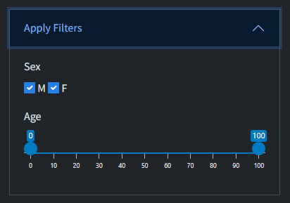

# Description

An R Shiny app for implementing a spline-based classification/detection approach to identify anomalous spatio-temporal clusters of patient health records, enabling rapid investigation.

# Rationale

This app approximates the scan-statistic in SaTScan, allowing ESSENCE bio-surveillance users (and others with flat files) experiment interactively with record groupings, baseline/test intervals, and clustering parameters.

# App Organization

-   **Top ribbon menus**:
    -   Data Loader\
    -   Clustering (enabled after ingestion)\
    -   Documentation\
    -   Report generation button (enabled after ingestion)

# Data Specification and Ingestion

You can ingest data two ways:

## Local File

<details>

<summary><strong>Local File</strong></summary>

-   **What it does**: Upload your own `.csv` or `.cas` file (must have these file extensions).
    1.  If providing a `.csv` file, the file must have column headers in the first row, and the columns must include `date`, `location`, and `count`, but the order of these does not matter. The app will try to parse the column named `date` to date values, and will return an error if this fails.
    2.  If providing a `.cas` file, the file must NOT have column headers, and can only have 3 columns, and these columns must represent a location, count, and date concept, **in that order**. The app will try to parse the third column to date, and will return an error if this fails.
-   **In-app flow**:
    1.  Click **Local File**
    2.  Browse to and select your file
    3.  Select the geographical resolution (i.e. county or zip). The app will try to detect the state(s) associated with the location values, and will use your selected geographical resolution as part of this detection process. If this detection process returns multiple states, select the state that matches your target file
    4.  Click **Ingest Data**

</details>

## NSSP API Call

<details>

<summary><strong>NSSP API Call</strong></summary>

-   **What it does**: Pull ESSENCE data via URL. The url may either be built using the controls provided, or a custom url may be pasted directly into the sidebar.\

-   **In-app flow**:

    1.  Click **NSSP API Call**
    2.  Choose **ad hoc URL** or **URL builder**
        -   **Ad hoc URL**: Paste a full ESSENCE query URL;
            -   the url must include a start date and end date parameter, and these parameters must b be valid dates; you can adjust date range but not categories/locations
            -   the url must include `timeResolution=daily` as one of its parameters
            -   the url must be a `tableBuilder` query
            -   the date range must not exceed 720 days
            -   the query must be json (not csv) query\
        -   **URL builder**: Walk through controls (see below) to assemble a URL.\
    3.  Click **Ingest Data**

    **URL Builder Controls**

    1.  **Date range**
        -   Start/end dates (default: last 120 days; allows ≥7-day test + ≥90-day baseline)\
    2.  **Geography**
        -   Resolution: ZIP code or county (ESSENCE maps ZIP to “region” for counties)
        -   State (single state or “All US + DC”)\
    3.  **Outcome** (record grouping)
        -   Syndrome (n=13)
        -   Sub-syndrome (n=134)
        -   CCDD category (n=137 as of April 2025)\
    4.  **Advanced Options** (ESSENCE-only)
        -   Data Source: this option controls which data source is leveraged when pulling data

            -   **Patient-level (default):** data will be pulled using `va_er` data source, and only records for individual patients with home address in the target state will be included in the counts

            -   **Facility-level:** data will be pulled using `va_hosp` data source, and records for individual patients with an encounter in the target state will be included. Note that this allows for encounters from out-of-state patients to be included in the counts, but the location of those out-of-states encounters is assigned to the zip code or county of the facility. (Encounters for in-state individuals are still assigned to the individual's zip code or county)

            -   **Note:** this choice does NOT affect whether a table builder or data-details query is generated (see below for information on data type)

        -   Data Type: This option controls whether a `tableBuilder` query is constructed and the resulting location-date-counts table is directly pulled, or whether a `dataDetails` query is constructed and the resulting line-level data is pulled, and then converted to a table of location-date-counts.

            -   **Table** (default): constructs a `tableBuilder` query. This is generally, although not always, faster. The individual records are not pulled to the app, and there is no ability to de-duplicate or filter on age or sex.

            -   **Data Details:** constructs a `dataDetails` query, and Individual records are pulled. This is generally, but not always, slower than the default option. The advantage to this is that you can choose to de-duplicate (see below), and can run clustering on subsets of the data using age and sex filters.

                -   When using this option, there is a toggle for de-duplication (which defaults to `TRUE`). When `TRUE`, the line-level data will be reduced in two ways. First, the data are filtered to exclude rows where `FacilityType` can be matched via regular expression to any of the following case-insensitive values: "urgent", "primary", "other", or "medical specialty". Second, the date are reduced to unique combinations of `VisitID` and `Hospital`. That is, if there are multiple rows (i.e. line-level encounters) with the same `VisitID` and `Hospital`, only the first of each such multi-row combination is retained. This can be turned off by sliding the toggle. The actual R code to implement this is seen below:

                    <details>

                    <summary><strong>De-duplication approach: R-code</strong></summary>

                    ```         
                    deduplicate_datadetails <- function(
                        data, 
                        excl_fac_types = "urgent|primary|other|medical speciality"
                    ) {
                      
                      if(!all(
                        c("FacilityType", "Visit_ID", "Hospital") %in% colnames(data)
                      )) {
                        cli::cli_abort(
                          "Cannot de-duplicate unless all of FacilityType, VisitID, and Hospital
                          are in the data frame"
                        )
                      }
                        
                      setDT(data) |>
                        # 1. filter out certain types
                        _[!grepl(excl_fac_types, FacilityType,ignore.case = T)] |>
                        # 3. deduplicate
                        _[order(Date), .SD[1], .(Visit_ID, Hospital)]
                      
                    }
                    ```

                    </details>

</details>

## Acquiring and Examining Raw Data

1.  Click **Ingest Data** (under one minute, varies with volume)\
2.  **Clustering** & **Report** menus activate\
3.  **Input table** (right panel):
    -   Columns: Location, Date, Count\
    -   Sort by header; filter via search box\
    -   Buttons to **Download** data or **View URL** (API mode)

# Data Explorer

After clicking **Clustering**, the left sidebar panel shows cluster controls; the right panel opens to **Data Explorer** with three modes:

## Data Summary

-   Compares baseline vs. test interval:
    -   Days, total records, avg records/day\
    -   Locations with/without data\
    -   Days with any counts

## Heatmap

-   Space-by-time grid, color-coded by daily count\
-   Vertical red line separates baseline/test\
-   Toggle log or √ scales\
-   Show/hide zero-data locations\
-   Interactive row-selection, zoom/pan

## Time Series

-   Daily total counts plot\
-   Helps reveal region-wide surges vs. local outbreaks

# Clustering

## Clustering Options

-   **Radius** (miles): ZIP default 15; county default 50\
-   **End date** of test interval\
-   **Max cluster duration** (days; default 7)\
-   **Baseline length** (days; default ≥90)\
-   **Advanced**:
    -   Spline sensitivity (p=0.05, 0.01 default, 0.005, 0.001)\
    -   Min/Max cluster count (default 2; up to 300)\
    -   Baseline adjustment:
        -   Add one as needed\
        -   Add test interval to baseline\
        -   No adjustment
-   **Apply Filters:** this option only appears if a data details query has been selected (see Advanced Options for Data Specifications). In this case, the user can chose to filter the returned data to any subset defined by the age and sex values in the underlying individual records. These additional filter options are controled by widgets that appear as below



## Cluster Computation and Inspection

1.  Click **Compute Clusters**\
2.  Runs in seconds (single state) to \~1 min (nationwide)\
3.  Results panel:
    -   “No Clusters” message or\
    -   **Cluster Summary** table + **Cluster Map** tab

## Cluster Table

| Column | Description |
|--------------------|----------------------------------------------------|
| **Center** | ZIP or county at cluster center |
| **Cluster Date** | Last date in cluster (≥1 record on this day) |
| **Duration** | Days spanned (≤ max duration) |
| **Observed** | Total records in cluster |
| **Expected** | Baseline-derived expected count |
| **Obs/Exp** | Ratio used for spline p-value interpolation |
| **p-value** | Significance (\<0.001 if significant at all spline levels) |
| **Max distance from center** | Miles from center to farthest location |
| **Number of locations** | Count of ZIPs/counties in cluster |
| **Cluster locations** | List (hover to reveal full list if truncated) |
| **ZIPs affected** | Expandable list of ZIPs/counties in cluster, regardless of case presence |

## Cluster Map

-   Outlines of all ZIPs/counties in region\
-   Colored shading per cluster\
-   Interactive zoom/pan; hover for:
    -   Location & center\
    -   Observed/expected per location\
    -   Cluster duration

# Generating Report

-   Enabled once data are ingested\
-   Includes:
    -   **Always**: Data Summary table, Heatmap, Time Series\
    -   **If clusters computed**: Cluster Summary table\
    -   **If map viewed**: Cluster Map\
-   Click **Generate Report**, edit default filename (`spatiotemporalclustering_report_YYYY-mm-dd.html`), choose save location

# Contacts

-   **Howard Burkom** – [howard.burkom\@jhuapl.edu](mailto:howard.burkom@jhuapl.edu){.email}\
-   **Luke Mullany** – [luke.mullany\@jhuapl.edu](mailto:luke.mullany@jhuapl.edu){.email}

# Copyright

© 2024 The Johns Hopkins University Applied Physics Laboratory LLC.\
Developed under U.S. Government Contract No. 75D30124C19958.
